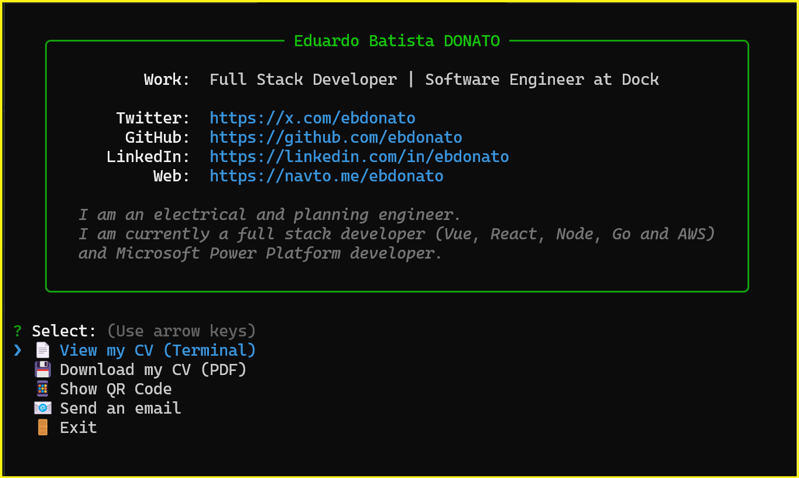

# ebdonato

A CLI business card and resume viewer - share your professional profile directly in the terminal.



<!-- TODO: Add a screenshot of the CLI in action -->

## The Problem

Sharing professional information typically requires sending links, PDFs, or directing people to websites. For developers and tech professionals, there's a more elegant solution: **a terminal-based business card**.

This package allows anyone to view your professional profile instantly with a single command - no browser, no downloads, no friction. It's memorable, developer-friendly, and showcases your technical skills in the process.

## Quick Start

Run directly with npx (no installation required):

```bash
npx ebdonato
```

That's it! You'll see an interactive menu with options to:

- **View CV** - Read the full resume directly in the terminal (Markdown rendered beautifully)
- **Download CV** - Save a PDF copy to your current directory
- **Show QR Code** - Display a scannable QR code for mobile access
- **Send Email** - Open your default email client to get in touch
- **Exit** - Close the application

## Features

- **Zero Installation** - Works instantly via `npx`
- **Interactive Menu** - Easy navigation with arrow keys
- **Terminal-Rendered Resume** - Markdown displayed with colors and formatting
- **PDF Download** - Get a professionally styled PDF resume
- **QR Code** - Quick mobile access to online profile
- **Cross-Platform** - Works on macOS, Linux, and Windows

## Create Your Own Business Card

Want to make your own CLI business card? Fork this project and customize it!

### Step 1: Fork and Clone

```bash
# Fork this repository on GitHub, then:
git clone https://github.com/YOUR_USERNAME/card-tui.git
cd card-tui
npm install
```

### Step 2: Customize Your Information

1. **Update `package.json`**:
    - Change `"name"` to your npm username (e.g., `"name": "johndoe"`)
    - Update `"description"`, `"author"`, and other metadata

2. **Edit `bin/index.js`**:
    - Update the `data` object with your personal information:
        ```javascript
        const data = {
            name: chalk.bold.green('Your Name'),
            handle: chalk.white('@yourhandle'),
            work: chalk.white('Your Title at Your Company'),
            twitter: chalk.cyan('https://x.com/yourhandle'),
            github: chalk.cyan('https://github.com/yourusername'),
            linkedin: chalk.cyan('https://linkedin.com/in/yourprofile'),
            web: chalk.cyan('https://yourwebsite.com'),
            // ... update labels and bio
        }
        ```
    - Update the email address in the `sendEmail()` function

3. **Replace `data/resume.md`**:
    - Write your resume in Markdown format
    - This content is displayed in the terminal and converted to PDF

4. **Customize PDF styling** (optional):
    - Edit `assets/resume.css` to change the PDF appearance

### Step 3: Build and Test

```bash
# Generate the PDF resume
npm run build

# Test locally
npm start

# Check for linting errors
npm run lint
```

### Step 4: Publish to npm

```bash
# Login to npm (create account at npmjs.com if needed)
npm login

# Publish your package
npm publish
```

Now anyone can run `npx yourusername` to see your business card!

### Tips for Customization

- **Colors**: Use `chalk` for terminal colors (`chalk.green()`, `chalk.cyan()`, `chalk.bold()`, etc.)
- **Box Style**: Modify `boxen` options in `showHeader()` for different border styles
- **Menu Options**: Add or remove choices in the `inquirer.prompt()` call in `main()`
- **QR Code**: Update the URL in `showQRCode()` to point to your profile

## Development

### Prerequisites

- Node.js (v18 or higher recommended)
- npm

### Commands

| Command                | Description                 |
| ---------------------- | --------------------------- |
| `npm start`            | Run the CLI locally         |
| `npm run build`        | Generate PDF from resume.md |
| `npm run lint`         | Check for code style issues |
| `npm run lint:fix`     | Auto-fix linting errors     |
| `npm run format`       | Format code with Prettier   |
| `npm run format:check` | Check code formatting       |

### Project Structure

```
card-tui/
├── bin/
│   └── index.js          # Main CLI application
├── data/
│   └── resume.md         # Resume content (Markdown)
├── assets/
│   ├── resume.css        # PDF styling
│   └── resume.pdf        # Generated PDF
├── build-cv.js           # PDF generation script
├── package.json          # Package configuration
└── AGENTS.md             # Guidelines for AI coding agents
```

## Tech Stack

- **[chalk](https://github.com/chalk/chalk)** - Terminal string styling
- **[inquirer](https://github.com/SBoudrias/Inquirer.js)** - Interactive command-line prompts
- **[boxen](https://github.com/sindresorhus/boxen)** - Create boxes in terminal
- **[marked](https://github.com/markedjs/marked)** + **[marked-terminal](https://github.com/mikaelbr/marked-terminal)** - Render Markdown in terminal
- **[qrcode-terminal](https://github.com/gtanner/qrcode-terminal)** - Generate QR codes
- **[open](https://github.com/sindresorhus/open)** - Open URLs/files in default application
- **[md-to-pdf](https://github.com/simonhaenisch/md-to-pdf)** - Convert Markdown to PDF

## Inspiration

This project is a complete rewrite and evolution of [ebdonato/npx_card](https://github.com/ebdonato/npx_card), rebuilt with modern ES Modules, updated dependencies, and an improved interactive experience.

Originally inspired by [anmol098/npx_card](https://github.com/anmol098/npx_card) - a brilliant idea for developer business cards in the terminal.

## License

MIT License - See [LICENSE](LICENSE) for details.

## Author

**Eduardo Batista Donato**

- GitHub: [@ebdonato](https://github.com/ebdonato)
- LinkedIn: [ebdonato](https://linkedin.com/in/ebdonato)
- Twitter: [@ebdonato](https://x.com/ebdonato)

---

If you create your own CLI business card using this project, I'd love to see it! Feel free to open an issue or reach out.
